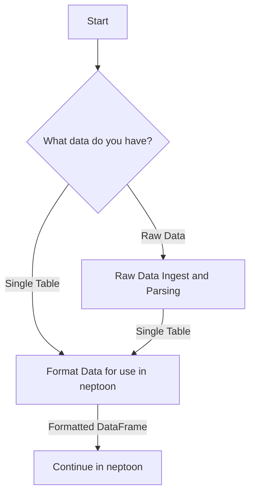

# Data Collection and Formatting

## Introduction

Data collection and formatting are crucial first steps when using neptoon. This section will explain the process of preparing your data for use with neptoon, whether you're a sensor owner with raw data files, or a researcher working with publicly available datasets.

## Why is this step important?

Proper data collection and formatting ensure that:
: 1. Your data is in a structure that neptoon can process efficiently.
2. Subsequent analysis and processing steps in neptoon will run smoothly.

Preparing data for use in neptoon goes through two distinct steps:

#### <u>Sensor Owners</u>
If you own or operate a CRNS, you likely have raw sensor files that need to be parsed and formatted. This mean that you might have a folder which contains 100s (or 1000s) of small `.txt` files containing the recorded information from your sensor. The first step then is parsing these files and converting them into a more standard format ready for use with neptoon. Neptoon provides tools to streamline this process, converting your raw data into a structured format ready for processing.
#### <u>Researchers, Students, and Citizen Scientists</u>
If all of your data is already in a structured format, for example, a `.csv` that can easily be read in as a DataFrame, we still need to prepare it ready for use in neptoon. 


### Process Flowchart

Given this how you import your data will depend on what stage your data is in. If it is raw sensor files, you need to utilise the parsing, filtering and preparing stage. This creates a single DataFrame ready for formatting. If you already have data available in a .csv or other structure format, you can skip the first step, import your data and go straight to the formatting step. 



!!! tip "Section Selection"
	- For File Collection see [here](#)
	- For Data Formatting see [here](#)

## Working with configuration files

Like everything in neptoon, it is possible to use pre-configured configuration files which automatically supply the settings for neptoon, allowing replicable data processing. Here we describe how to do this, as it is the most efficient way of using neptoon. More detailed descriptions on using neptoon directly, for example in a Jupyter notebook, are outlined below for those who wish to do this.

If you want to import and format your data using a yaml file - first you make sure the configuration file is appropriately filled out (see [here](intro-to-config.md) for more information on that). After this you run the following code:

```python
from neptoon.data_ingest_and_formatting import CollectAndParseRawData
data_creator = CollectAndParseRawData(path_to_yaml="path/to/your_config.yaml")
crns_df = data_creator.create_data_frame()
```

The code will use the provided information in the YAML file to parse, format and produce a DataFrame ready for use in `neptoon`.

Below we will outline how you might use the available methods in neptoon to ingest and format data in your python IDE. The quickest way will always be the YAML file method, however we understand there could be instances where building these pipelines manually is preferred. 
## Data Ingest

### Raw Data

- 
- File Collection
- Parsing

### Public Data
(WIP)

## Data Formatting


1. Options
2. Adding Columns-metadata manually
3. Time Zones
