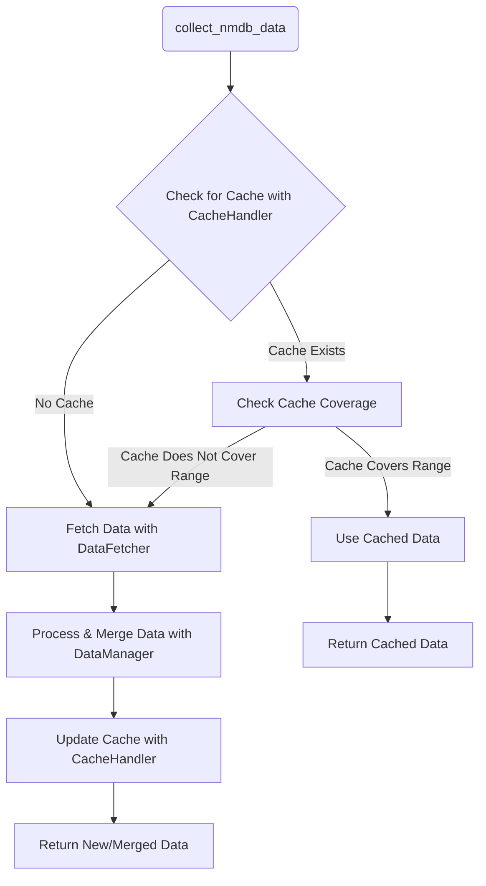

```mermaid
graph TD
    A(collect_nmdb_data) --> B{Check for Cache with CacheHandler}
    B -->|Cache Exists| C[Check Cache Coverage]
    B -->|No Cache| D[Fetch Data with DataFetcher]
    C -->|Cache Covers Range| E[Use Cached Data]
    C -->|Cache Does Not Cover Range| D
    D --> F[Process & Merge Data with DataManager]
    F --> G[Update Cache with CacheHandler]
    E --> H[Return Cached Data]
    G --> I[Return New/Merged Data]

```
