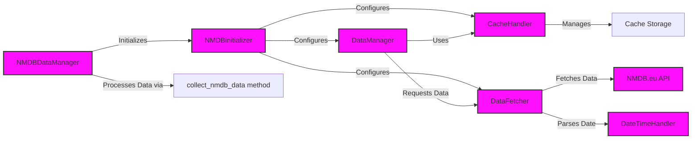

This is a test of flow diagrams in gitlab.

Below is a diagram showing the connections of classes within the NMDB processes.

```mermaid
graph LR
    style A fill:#f1f,stroke:#333,stroke-width:2px
    style B fill:#f1f,stroke:#333,stroke-width:2px
    style C fill:#f1f,stroke:#333,stroke-width:2px
    style D fill:#f1f,stroke:#333,stroke-width:2px
    style E fill:#f1f,stroke:#333,stroke-width:2px
    style G fill:#f1f,stroke:#333,stroke-width:2px
    style NMDBDH fill:#f1f,stroke:#333,stroke-width:2px

    NMDBDH[NMDBDataManager] -->|Initializes| A[NMDBinitializer]
    A -->|Configures| B[DataManager]
    A -->|Configures| C[DataFetcher]
    A -->|Configures| D[CacheHandler]

    C -->|Fetches Data| E[NMDB.eu API]
    D -->|Manages| F[Cache Storage]
    B -->|Uses| D
    B -->|Requests Data| C
    C -->|Parses Date| G[DateTimeHandler]
    NMDBDH -->|Processes Data via| H[collect_nmdb_data method]
```
