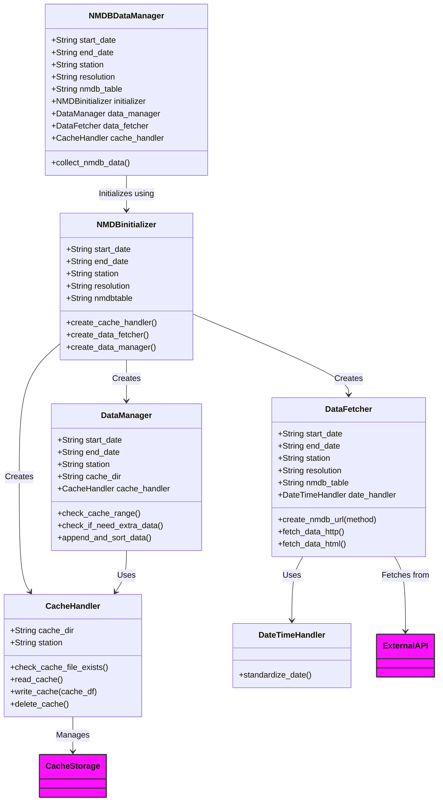

This is a test of a class flow diagram for NMDB process.

```mermaid
classDiagram
    class NMDBDataManager {
        +String start_date
        +String end_date
        +String station
        +String resolution
        +String nmdb_table
        +NMDBinitializer initializer
        +DataManager data_manager
        +DataFetcher data_fetcher
        +CacheHandler cache_handler
        +collect_nmdb_data()
    }
    class NMDBinitializer {
        +String start_date
        +String end_date
        +String station
        +String resolution
        +String nmdbtable
        +create_cache_handler()
        +create_data_fetcher()
        +create_data_manager()
    }
    class DataManager {
        +String start_date
        +String end_date
        +String station
        +String cache_dir
        +CacheHandler cache_handler
        +check_cache_range()
        +check_if_need_extra_data()
        +append_and_sort_data()
    }
    class DataFetcher {
        +String start_date
        +String end_date
        +String station
        +String resolution
        +String nmdb_table
        +DateTimeHandler date_handler
        +create_nmdb_url(method)
        +fetch_data_http()
        +fetch_data_html()
    }
    class CacheHandler {
        +String cache_dir
        +String station
        +check_cache_file_exists()
        +read_cache()
        +write_cache(cache_df)
        +delete_cache()
    }
    class DateTimeHandler {
        +standardize_date()
    }
    class ExternalAPI
    class CacheStorage

    style ExternalAPI fill:#f1f,stroke:#333,stroke-width:2px
    style CacheStorage fill:#f1f,stroke:#333,stroke-width:2px

    NMDBDataManager --> NMDBinitializer : Initializes using
    NMDBinitializer --> DataManager : Creates
    NMDBinitializer --> DataFetcher : Creates
    NMDBinitializer --> CacheHandler : Creates
    DataManager --> CacheHandler : Uses
    DataFetcher --> DateTimeHandler : Uses
    DataFetcher --> ExternalAPI : Fetches from
    CacheHandler --> CacheStorage : Manages
```
